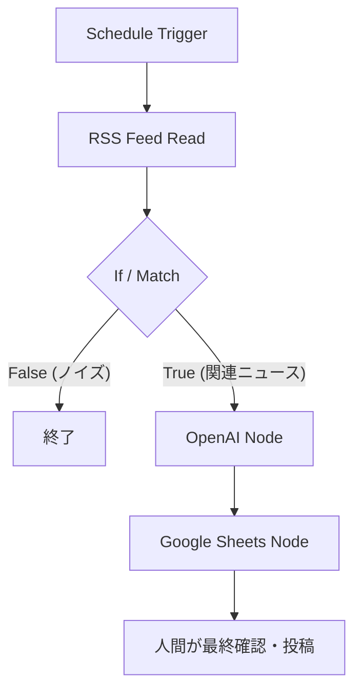

# 🧩 n8n_workflow_guide: ワークフロー設計書

このドキュメントでは、あなたがインポートする「特化型SNSアカウント＆アフィリエイト半自動化」ワークフローの全体像と、各ノードの役割・構成について解説します。

---

## 🗺 ワークフローの全体像

本システムは、**毎日指定した時間（例: 6:00, 12:00, 18:00 UTC）に自動的に実行され、SNS投稿の素材を生成・蓄積**する仕組みです。

---

## ⚙️ 必要なノード構成と役割

本ワークフローは、以下の**基本5ノード（+1）**で構成されています。

### 1. `Schedule`（トリガーノード）
- **役割**: ワークフローの実行タイミングを決定します。
- **おすすめ設定**:
  - `Rule`: Cron Expression
  - `Expression`: `0 6,12,18 * * *` (毎日UTC時間 6:00, 12:00, 18:00に実行)
- **注意点**: サーバーのタイムゾーンがUTCかJSTかを確認して設定してください。

### 2. `RSS Feed Read`（ニュース取得ノード）
- **役割**: 指定したニュースサイトから最新記事を自動収集します。
- **おすすめ設定**:
  - `URL`: あなたの特化ジャンルに合ったRSSフィード（例: TechCrunch, CoinPost, ロイターなど）
  - `Return All`: チェックを入れると複数件一気に取得可能。まずは最新3〜5件に制限するのがおすすめ。

### 3. `If / Match`（キーワード絞り込みノード）
- **役割**: 取得したニュースの中から、あなたのSNSコンセプトに合致するものだけを抽出します。
- **おすすめ設定**:
  - `Condition 1`: 文字列（String）
  - `Value 1`: `= {{ $json.title }}`
  - `Operation`: `Contains`
  - `Value 2`: （例: AI, 投資, 暗号資産 など）
- **注意点**: もしキーワードが複数ある場合は、「Add Condition」で OR 条件を追加してください。

### 4. `OpenAI`（AI分析・投稿案作成ノード）
- **役割**: 抽出したニュース記事のURLやタイトルを元に、ChatGPTに分析させ、140字〜300字程度の「SNS投稿案」を作成させます。
- **おすすめ設定**:
  - `Model`: `gpt-4o-mini` または `gpt-4o` (コスト重視なら mini がおすすめ)
  - `System Message`: （※`n8n_prompt_guide.md`参照）
  - `User Message`: 「以下のニュースタイトルとリンクを元に、魅力的なSNS投稿を作成してください。 URL: {{ $json.link }} タイトル: {{ $json.title }}」

### 5. `Google Sheets`（自動保存ノード）
- **役割**: AIが生成した投稿案をスプレッドシートに追記（Append）します。
- **おすすめ設定**:
  - `Operation`: Append
  - `Document ID`: あなたのスプレッドシートID
  - `Sheet Name`: 例: `posts`
  - マッピング:
    - `A列` = 作成日時 `{{ $now }}`
    - `B列` = 元ニュースタイトル `{{ $json.title }}`
    - `C列` = 元ニュースURL `{{ $json.link }}`
    - `D列` = AI生成投稿案 `{{ $json["response"] }}`

---

## ✅ 具体的な設定手順とカスタマイズのヒント

1. **ノードの連結**
   設定画面上でノード間の線を繋ぐ（またはインポートした時点で繋がっている）ことを確認してください。
2. **テスト（Execute Workflow）**
   全体をオン（Active）にする前に、画面下の「Execute Workflow」ボタンを押し、エラーが出ないかテストしてください。
3. **RSSフィードの複数設定**
   より多くの情報を集めたい場合は、RSS Feedノードを並列で2〜3個配置し、Mergeノードで合流させると効率的です。

準備ができたら、次は `n8n_workflow.json` を実際にn8nへインポートしましょう！
